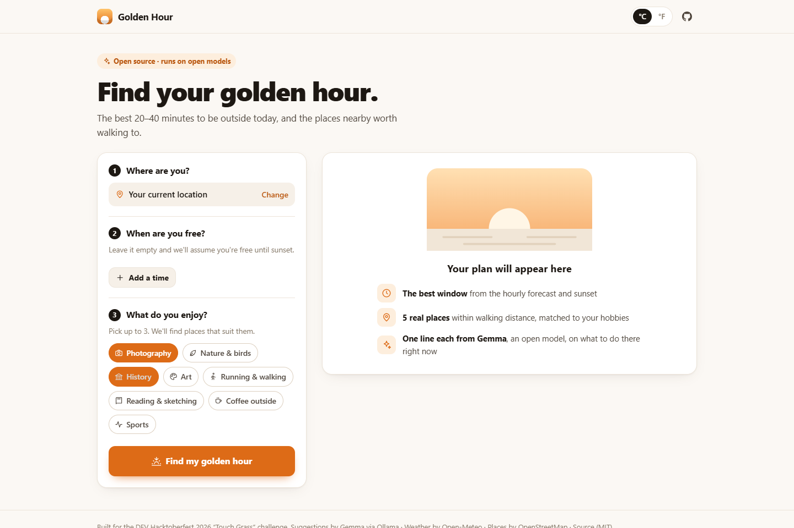
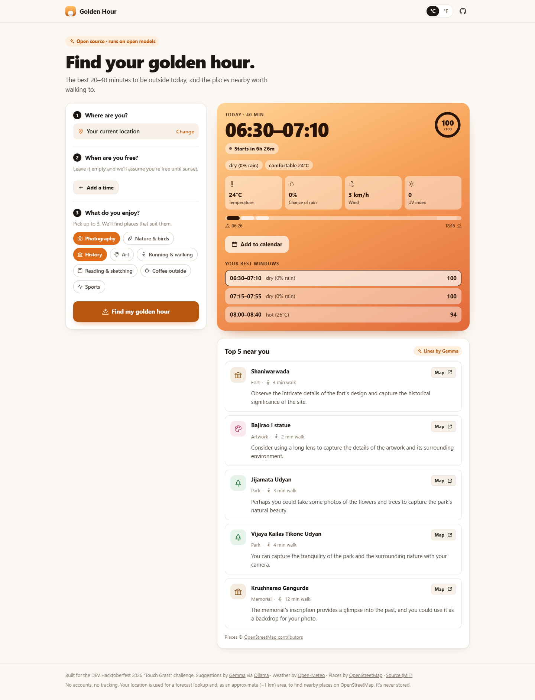
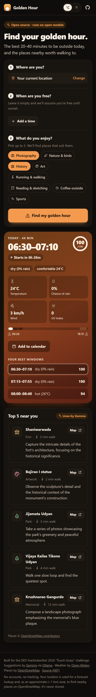

# 003 — Visual redesign: Design

- **Status:** Approved (2026-10-10)
- **Implements:** [requirements.md](requirements.md)

## Screens (prototype, local, real data)

| Desktop, light, before search | Desktop, light, result | Phone, dark, result |
|---|---|---|
|  |  |  |

## Decisions

- **Same files, same IDs.** `index.html`, `style.css` and `app.js` are rewritten. Every element ID used
  by `app.js` and the browser tests is kept (the place-row template is renamed `place-row-tpl` because
  `place-row` is now the chosen-location row).
- **Tokens first.** All colours are CSS custom properties on `:root`, redefined under
  `prefers-color-scheme: dark`. Category colours (park green, water blue, art pink…) apply only to place
  icons.
- **System fonts.** `ui-sans-serif, system-ui, …`: no download, no third-party request (V7).
- **Icons.** An inline SVG sprite of ~30 simple stroke icons in `index.html`; `<use href="#i-…">`
  everywhere. The brand mark and favicon are CSS/SVG, not emoji.
- **`[hidden] { display: none !important; }`** globally. Without it, component `display` rules override
  the `hidden` attribute; the prototype showed loading skeletons that never disappeared.
- **Timeline** spans sunrise → sunset + 15 min (the scoring window, 001 design §4.2), shades the golden
  hour, draws each candidate window, and marks "now" when it falls inside.
- **Window options** list the best window and the alternates together, with the chosen one pressed
  (`aria-pressed`); the heading says "Your best windows".
- **Mobile:** after a search the page scrolls to the result; on desktop it doesn't, because the result is
  already beside the planner.

## Changelog

- 2026-10-10 — Initial draft.
